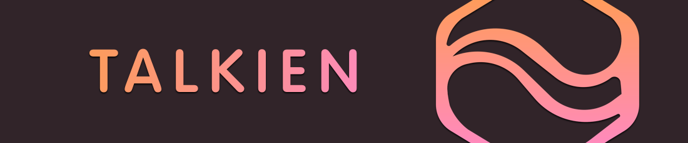

 

> One app to rule all talks.

Tired of installing one app for each conference you go ?

No problem, we developed an open-source app for you. **Talkien** is bringing together all conferences into a single location. Run the app, and find your conference with its program.

We're currently targeting only French conferences.

Application available on:
 - [iOS](https://bit.ly/iOSTalkien)
 - [Android](https://bit.ly/AndroidTalkien)

## Data

All app data is hand-gathered, and available in [this repository](https://github.com/kb-dev/talkien-events).

## Development

- Install Node.js + npm
- `npm install -g expo`
- `npm install`
- `expo start`
